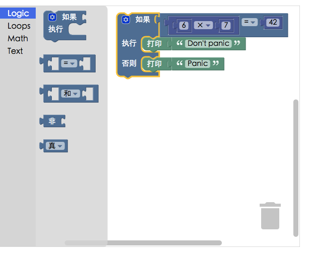

# Blockly与Scratch3.0的比较分析
----

## Blockly是什么

> The web-based visual programming editor
> 
> blockly作为编辑器，它的输入为用户的拖曳（拖曳作为一种输入，可以类比为普通编辑器的键盘输入），输出为生成的代码。使用blockly可以快速打造一个特定领域的可视化 块编程 编辑器
> 
> 至于每个积木（block）如何生成代码，代码用于什么用途，blockly则通通不关心，用户自己掌控。

我们可以简单将blockly视为积木化的编辑器，编辑器的输出只有代码。Do one thing的原则让它成为一个灵活小巧的库，而不是框架，可以轻松与其他工具整合

## Scratch3.0是什么

> Scratch3.0是Scratch2.0的下一个版本，使用html5构建
> 
> Scratch3.0是个低门槛、宽围墙、高天花板playground
> 
> Scratch3.0是一个Blockly APP
> 
> Scratch3.0是scratch-gui + scratch-vm +scratch-render + ...
> 
> Scratch3.0是那种你用过就知道是什么的东西

Scratch3.0基于Blockly构建，就是说Scratch3.0中包含了Blockly。

Scratch之前并不是基于Blockly构建的，3.0的版本里，才这样做，为何之前的Scratch不基于Blockly呢，因为Scratch这个项目比Blockly更早诞生，Scratch前几个版本的积木块都是自己造的轮子。现在Blockly几乎是公认最好的积木化编辑器，所以Scratch在3.0里把轮子换成Blockly

Scratch3.0是个庞大的项目，包含了很多组件，只有其中的scratch-blocks基于Blockly

## 比较分析

我们可以把Blockly视为一个库，而把Scratch3.0视为一个框架。一个库往往遵循Do one thing的Unix哲则，你可以轻松将它组合到你的项目中，Blockly库只负责从积木中生成代码，怎么去使用这些代码？这些代码是控制虚拟角色还是实际的硬件？它何时被解释运行？是否支持并行？代码运行生命周期是怎样的？解释器在本地还是在另一个硬件上？Blockly通通不关心。Blockly给予你自由，同时你也不得不肩负起自己的责任，你需要去考虑构建一个Blockly APP剩下的部分.

相比于Blockly，Scratch3.0则更像一个框架，Scratch3.0几乎开箱可用，它有各个组件，你可以通过修改这些组件来定制它，当然你需要先理解它。你可以通过插件系统加入自己的扩展，无论是软件还是硬件，你都可以进行拓展。

说Scratch3.0是框架，侧重在强调它的结构完整性和灵活性，它不是vue、django那种框架，Scratch3.0介于框架和项目之间，它给予你的自由度要比一般意义上的框架要小

Scratch3.0的解释器相关部分:scratch-vm 十分强大和灵活，要做到这点很不容易。如果你在做和Scratch3.0类似的事，最后不要重造轮子。已经有大厂试着从Blockly开始，重造一个Scratch3.0，他们确实也造出来了。很难的工作在于重写scratch-vm。在一个典型blockly APP中，大家一般使用官方推荐的interpreter来解释执行代码，但在一个复杂项目中，可能是不够的。如果你准备重写scratch-vm，最好有懂解释器的人。而且最好不要去做这件事，尽管你可能做得到，但它的灵活性很难有scratch-vm那么好。

## 前端选型

使用Blockly的优势，如前边说的：轻量，自由，但也意味着我们要去操心更多解释和实现上的细节工作，这是个复杂的工作；使用scratch的话，我们只要专心写插件部分就好了！

对于少儿编程项目来说，使用scratch可以帮助我们省去一些写插件的繁琐步骤，而blockly轻量自由的优势对我们来说优先级并没有那么高，因此我们最终选择scratch3.0。