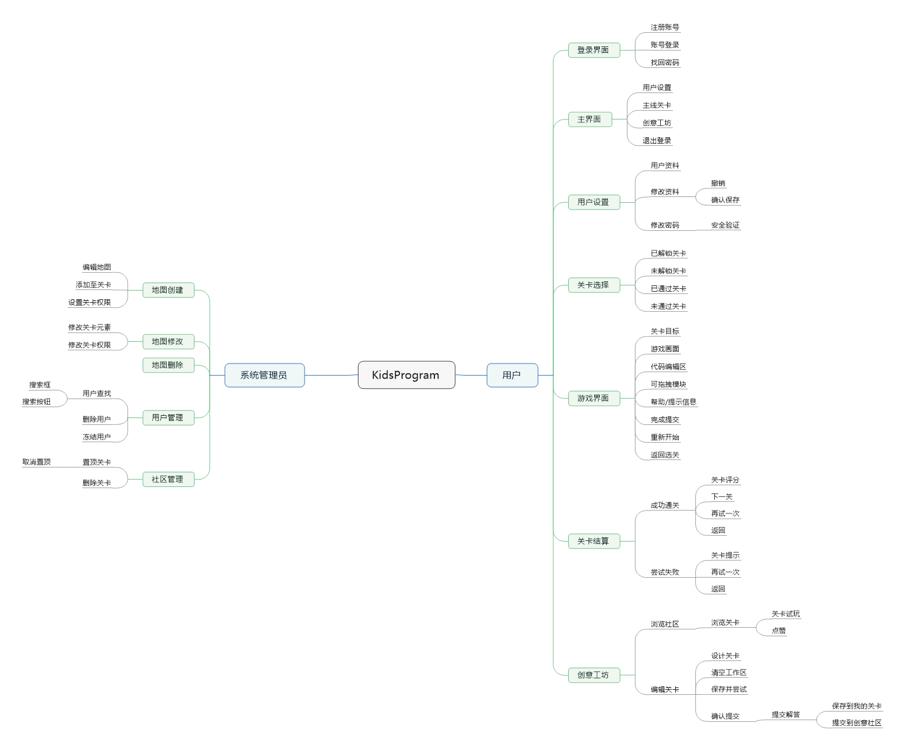

## 用户故事修改意见3.0

1.增加思维导图

2.增加管理员用户故事

# 用户部分

## 故事一	用户在网站注册账号

1.用户打开网站

2.系统显示初始界面

3.用户点击【注册】按钮

4.系统显示注册界面

5.用户输入用户名（邮箱或电话号码）并点击【发送验证】按钮

6.系统检测用户名是否合法，若不合法显示“该用户名不符合要求！”或者“该用户名已被注册！”

7.若用户名合法，系统发送验证

8.用户输入验证码，点击【提交】按钮

9.系统确认验证码，显示“验证码错误”或者“验证成功”

10.验证成功后系统显示注册成功页面

## 故事二	用户尝试找回密码

1.用户打开网站

2.系统显示初始界面

3.用户点击【找回密码】按钮

4.系统显示找回密码界面

#### 分支2.1

5.用户点击【通过手机验证】按钮

6.系统显示手机验证界面

7.用户输入待找回密码的手机号，并点击【发送验证】按钮

8.系统将验证短信发送到用户手机，并将【发送验证】按钮变更为“60秒后再次发送”

#### 分支2.2

5.用户点击【通过邮箱验证】按钮

6.系统显示邮箱验证界面

7.用户输入待找回密码的邮箱账号，并点击【发送验证】按钮

8.系统将验证码发送到用户邮箱，并将【发送验证】按钮变更为“60秒后再次发送”

#### 分支结束

9.用户输入验证码并点击【验证】按钮

10.系统检测验证码，若错误，提示“验证码错误”

11.若验证码正确，系统显示密码重置页面

12.用户输入密码，并输入密码确认，点击【确认修改】按钮

13.系统验证两次输入密码是否相同，若不同显示“两次密码不同！“

14.两次密码相同，系统返回修改成功页面

## 故事三	用户在网站登录

1.用户打开网站

2.系统显示初始界面

3.用户输入用户名和密码并点击【登录】按钮

4.系统验证账号信息，若错误，显示“用户名或者密码错误！”

5.若正确，则登录成功，系统显示用户主页

## 故事四	用户登录后在网站登出

1.用户点击主页上的【退出登录】按钮

2.系统提示“是否退出当前账号？”

3.用户点击【确认退出】按钮

4.系统显示初始页面（未登录状态）

## 故事五	用户在网站修改密码

1.用户点击主页上的【个人中心】按钮

2.系统显示用户个人中心

3.用户点击个人中心上的【账号信息】按钮

4.系统显示用户账号信息

5.用户点击账号信息页面的【修改密码】按钮

6.系统显示安全认证页面

7.用户输入安全验证（密码或二级密码）并点击【验证】

8.系统验证密码，密码错误则显示“密码错误”

9.密码正确，系统显示修改账号信息界面

10.用户输入密码，并输入密码确认，点击【确认修改】按钮

11.系统验证两次输入密码是否相同，若不同显示“两次密码不同！“

12.两次密码相同，系统返回修改成功页面

## 故事六	用户在网站以游客身份玩试玩关卡

1.用户打开网站

2.系统显示初始界面

3.用户点击【游客登录】按钮

4.系统显示游客主页

5.用户点击【试玩关卡】对应按钮

6.系统显示对应的试玩关卡

7.用户通过关卡

8.系统显示结算界面

9.用户点击【下一关】按钮

10.系统显示“您当前处于游客登录状态，是否登录并保存通关信息？”

### 分支事件6.1

11.用户点击【否】按钮

12.系统显示下一关

### 分支事件6.2

11.用户点击【是】按钮

12.系统显示登录界面

## 故事七	用户以游客身份尝试玩非试玩关卡

1.用户打开网站

2.系统显示初始界面

3.用户点击【游客登录】按钮

4.系统显示游客主页

5.用户点击【非试玩关卡】对应按钮

6.系统显示游客登录提示页面

## 故事八	用户登录后完成关卡并得到评分

1.用户点击主页上的【主线关卡】按钮

2.系统显示主线关卡选关页面

3.用户点击【关卡】对应按钮

4.系统显示关卡页面

5.用户通过系列操作完成关卡

6.系统显示结算评分页面，并将通关信息存储进数据库

## 故事九	用户尝试游玩未解锁的关卡

1.用户点击主页上的【主线关卡】按钮

2.系统显示主线关卡选关页面

3.用户点击【关卡】对应按钮（该关卡尚未解锁）

4.系统显示提示页面

5.用户点击【确认】按钮

6.系统返回主线关卡选关页面

## 故事十	用户访问网站主页将通关情况进行分享

1.用户点击主页上的【分享】按钮

2.系统显示分享页面

3.用户点击【分享渠道】对应按钮

4.系统生成分享信息，并转入对应接口平台

## 故事十一	用户通关后在关卡结算页面进行分享

1.用户通过系列操作完成关卡

2.系统显示结算评分页面，并将通关信息存储进数据库

3.用户点击【分享】按钮

4.系统显示分享页面

5.用户点击【分享渠道】对应按钮

6.系统生成分享信息，并转入对应接口平台

## 故事十二	用户访问网站设计并发布自己的关卡

1.用户点击主页上的【创意工坊】按钮

2.系统显示创意工坊页面

3.用户点击【设计我的关卡】按钮

4.系统显示关卡设计页面

5.用户通过系列操作完成关卡的设计

6.用户点击【确认提交】按钮

7.系统显示提示页面“请为您的关卡提供至少一种解法”

8.用户点击【开始尝试】按钮

9.系统显示试玩页面

10.用户通过操作通过关卡

11.系统显示关卡通过页面

12.用户点击【确认完成】按钮

13.系统将制作完成的关卡存入数据库并放进用户创意工坊的关卡仓库

14.用户点击【我的关卡】按钮

15.系统显示用户的关卡仓库页面

16.用户点击【分享到社区】按钮

17.系统显示确认页面

18.用户点击【确认分享】按钮

19.系统将该关卡分享到创意工坊社区

## 故事十三	用户在创意工坊编辑页面退出后试图重新进入

1.用户点击主页上的【创意工坊】按钮

2.系统显示创意工坊页面

3.用户点击【设计我的关卡】按钮

4.系统显示关卡设计页面

5.用户点击【草稿箱】按钮

6.系统显示关卡设计页面，并载入上次保存的数据

## 故事十四	用户从创意工坊中选择他人设计的关卡

1.用户点击主页上的【创意工坊】按钮

2.系统显示创意工坊页面

3.用户点击【创意工坊社区】按钮

4.系统显示创意工坊社区页面

5.用户点击某一关卡下的【试玩】按钮

6.系统显示该关卡

7.用户通过操作完成关卡

8.系统显示“恭喜通关！是否为该关卡点赞？”

9.用户点击【点赞】按钮

10.系统记录点赞信息，返回创意工坊社区页面

## 故事十五	用户在创意工坊为他人的关卡点赞

1.用户点击主页上的【创意工坊】按钮

2.系统显示创意工坊页面

3.用户点击【创意工坊社区】按钮

4.系统显示创意工坊社区页面

5.用户点击某一关卡下的【点赞】按钮

6.系统记录点赞信息

# 管理员部分

## 故事一	管理员登录

## 故事二	管理员新建关卡

1.管理员点击【关卡管理】按钮。

2.系统显示关卡管理页面。

3.管理员点击【新建关卡】按钮。

4.系统显示关卡编辑页面。

5.管理员完成关卡编辑并点击【保存】按钮。

6.系统将关卡信息保存到关卡仓库。

## 故事三	管理员删除关卡

1.管理员点击【关卡管理】按钮。

2.系统显示关卡管理页面。

3.管理员选中关卡，点击【操作】按钮。

4.系统显示操作展开栏。

5.管理员点击【删除关卡】按钮。

6.系统提示“确认删除关卡？”

7.管理员点击【确认】。

8.系统删除关卡。

## 故事四	管理员将关卡设置为主线关卡

1.管理员点击【关卡管理】按钮。

2.系统显示关卡管理页面。

3.管理员选中关卡，点击【操作】按钮。

4.系统显示操作展开栏。

5.管理员点击【设置为主线关卡】按钮。

6.系统提示“确认设置为主线关卡？”

7.管理员点击【确认】按钮。

8.系统将关卡添加到主线关卡列表。

## 故事五	管理员对主线关卡重新排序

1.管理员点击【关卡管理】按钮。

2.系统显示关卡管理页面。

3.管理员点击【主线关卡列表】按钮。

4.系统显示主线关卡列表。

5.管理员拖拽关卡并上下移动，将关卡重新排序。

6.管理员点击【保存更改】按钮。

7.系统保存修改。

## 故事六	管理员将主线关卡设置为普通关卡

1.管理员点击【关卡管理】按钮。

2.系统显示关卡管理页面。

3.管理员点击【主线关卡列表】按钮。

4.系统显示主线关卡列表。

5.管理员点击关卡后的【设置为普通关卡】按钮。

6.系统将该关卡设置为普通关卡。

## 故事七	管理员查找用户

1.管理员点击【用户管理】按钮。

2.系统显示用户列表。

3.管理员在搜索框中输入关键字。

4.管理员点击【搜索】按钮。

5.系统显示筛选后的用户。

## 故事八	管理员删除用户

1.管理员点击【用户管理】按钮。

2.系统显示用户列表。

3.管理员点击特定用户后的【操作】按钮。

4.系统显示操作列表。

5.管理员点击【删除】按钮。

6.系统提示“您确定删除该账号吗？”

7.管理员点击【确认】。

8.系统删除该账号。

## 故事九	管理员冻结用户

1.管理员点击【用户管理】按钮。

2.系统显示用户列表。

3.管理员点击特定用户后的【操作】按钮。

4.系统显示操作列表。

5.管理员点击【冻结账号】按钮。

6.系统显示账号冻结页面。

7.管理员输入冻结时长，点击【确认冻结】

8.系统提示“您确定冻结该账号吗？”

9.管理员点击【确认】。

10.系统将该账号冻结。

## 故事十	管理员将社区关卡置顶

1.管理员点击【社区管理】按钮。

2.系统显示社区管理页面。

3.管理员点击关卡后的【置顶】按钮。

4.系统将该关卡置顶。

## 故事十一	管理员取消置顶关卡

1.管理员点击【社区管理】按钮。

2.系统显示社区管理页面。

3.管理员点击【查看置顶关卡】按钮。

4.系统显示置顶关卡。

5.管理员点击关卡后的【取消置顶】按钮。

6.系统取消该关卡的置顶。

## 故事十二	管理员删除关卡

1.管理员点击【社区管理】按钮。

2.系统显示社区管理页面。

3.管理员点击关卡后的【删除】按钮。

4.系统显示提示“您确定删除该关卡吗？”

5.管理员点击【确认删除】按钮。

6.系统将该关卡删除。

# 思维导图

