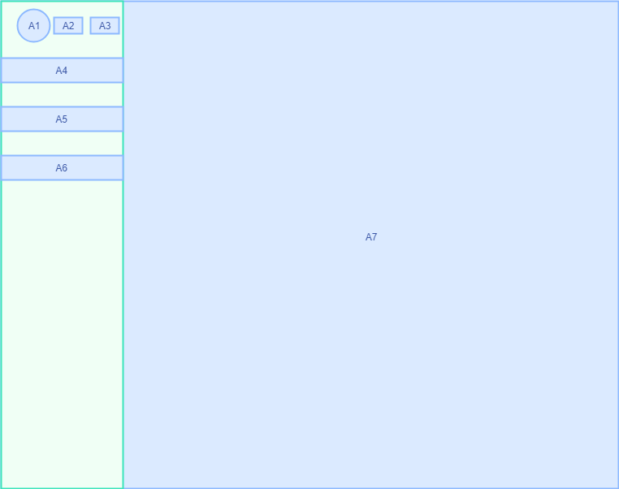
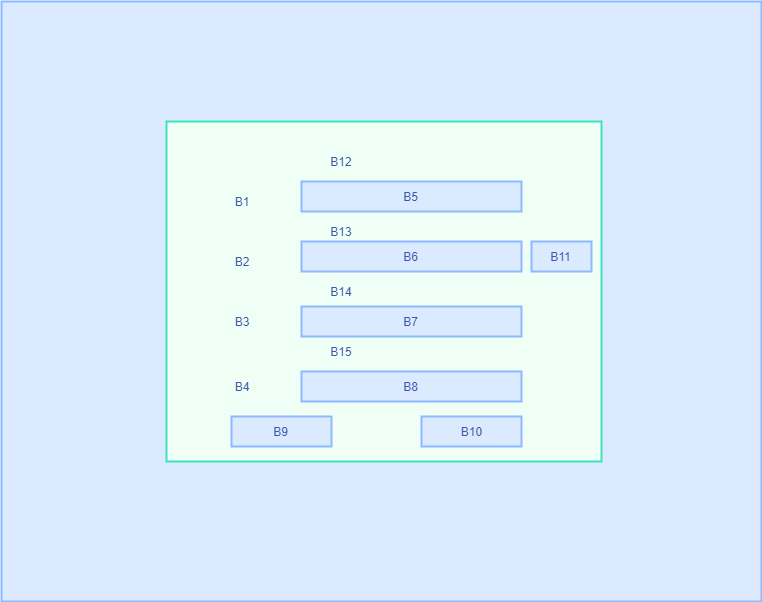
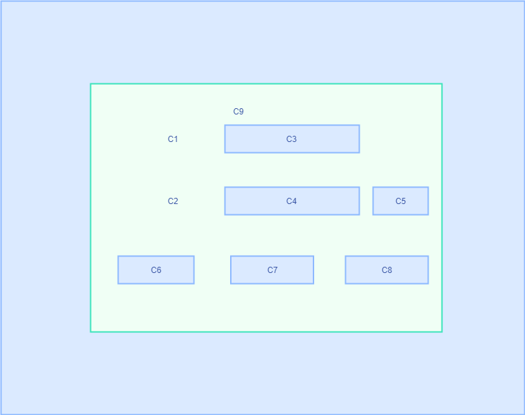
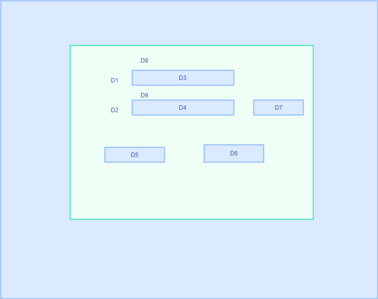
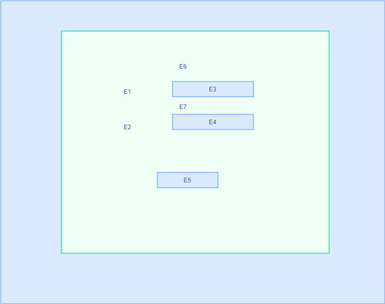

# 网站主页A

## A1

该处显示默认头像，用户登录后，显示用户设置的头像

## A2

该处显示【登录】按钮，点击后跳转至登录页面C。

若用户已经登录，则该处显示【注销】按钮，点击后将网站主页重置到未登录状态。

## A3

该处显示【注册账号】按钮，点击后跳转至注册页面B。

若用户已经登录，该按钮不再显示。

## A4

该处显示【个人中心】按钮，点击后跳转至个人中心页面。

未登录时点击，会跳转至登录页面C。

## A5

该处显示【主线关卡】按钮，点击后跳转至主线关卡页面。

## A6

该处显示【创意工坊】按钮，点击后跳转至创意工坊页面。

未登录时点击，会跳转至登录页面C。

## A7

该处显示主页推送内容（具体内容待定）

# 注册页面B

## B1

该处显示文本【手机号：】

## B2

该处显示文本【验证码：】

## B3

该处显示文本【输入密码】

## B4

该处显示文本【确认密码】

## B5

该处为输入框，用户在框中输入待注册的手机号

## B6

该处为输入框，用户在框中输入验证码

## B7

该处为输入框，用户在框中输入密码

## B8

该处为输入框，用户在框中重复输入密码

## B9

该处显示【确认注册】按钮

当用户点击【确认注册】按钮时，系统按以下规则检测B5、B6、B7、B8四处的文本：

1.四处文本均不为空。

2.B6处填入的验证码与系统最后一次发送至B5手机号的验证码一致。

3.B7处填入的密码超过6位且不为纯数字。

4.B8与B7处填入的密码一致。

若四项均满足，则系统将该账号信息录入，跳转至登录页面C。

若某项不满足，则根据不满足的规则作出以下反应：

1.将为空处对应的文本（B12~15）置为【该处不能为空！】

2.将B13处的文本置为【验证码错误！】

3.将B14处的文本置为【密码必须超过6位且不为纯数字】

4.将B15处的文本置为【两次密码不一致！】

## B10

该处显示【返回】按钮

点击该按钮返回游客登录状态的网站主页A。

## B11

该处显示【发送验证码】按钮

点击该按钮将检索用户在B5框中填入的是否为合法手机号。

若B5填入的手机号合法，系统向该手机号发送验证码，同时B11处变为文本【xx后重新发送】（xx为自60s开始的倒计时），倒计时结束后，该处变回【发送验证码】按钮。

## B12~B15

默认显示均为空文本。

控制规则详见B9项。

# 登录页面C

## C1

该处显示文本【账号：】

## C2

该处显示文本【密码：】

## C3

该处为输入框，用户在框中输入已注册账号

## C4

该处为输入框，用户在框中输入密码

## C5

该处为【找回密码】按钮，点击后跳转至找回密码页面D

## C6

该处为【登录】按钮，点击后按以下规则检测C3\C4处输入的内容：

1.C3、C4不为空

2.C3处输入的为已注册账号

3.C3、C4输入的账号密码正确匹配

若均满足，则跳转至已登录状态的网站主页A

否则，根据不满足的规则作出以下反应:

1.将C9的文本更新为【账号和密码不能为空】

2.将C9的文本更新为【该账号未注册！】

3.将C9的文本更新为【账号或密码错误！】

## C7

该处为【注册账号】按钮

点击该按钮跳转至注册页面B

## C8

该处为【返回主页】按钮

点击该按钮跳转至游客登录状态下的网站主页A

# 找回密码页面D

## D1

该处显示文本【手机号：】

## D2

该处显示文本【验证码：】

## D3

该处为输入框，用户在框中输入手机号

## D4

该处为输入框，用户在框中输入验证码

## D5

该处为【验证】按钮，点击后按照以下规则检测D3\D4处的文本：

1.D3、D4均不为空

2.D3处为合法的已注册手机号

3.D4处输入的验证码与系统最后一次发往D3处手机号的验证码一致

若均满足，跳转至重置密码页面E

否则，根据不满足的规则作出如下反应：

1.更新D8处的文本为【手机号及验证码不能为空！】

2.更新D8处的文本为【请输入合法的已注册账号！】

3.更新D9处的文本为【验证码错误！】

## D6

该处为【返回】按钮，点击后返回登录页面C

## D7

该处显示【发送验证码】按钮

点击该按钮将检索用户在B5框中填入的是否为合法且已注册的手机号。

若B5填入的手机号满足要求，系统向该手机号发送验证码，同时B11处变为文本【xx后重新发送】（xx为自60s开始的倒计时），倒计时结束后，该处变回【发送验证码】按钮。

## D8&D9

该两处均为默认值为空的文本，控制方式详见D5

# 重置密码页面E

## E1

该处显示文本【新密码：】

## E2

该处显示文本【确认密码：】

## E3

该处为文本框，用户在框中输入密码。

## E4

该处为文本框，用户在框中输入密码。

## E5

该处为【确认重置】按钮，点击后根据以下规则验证E3、E4处的输入：

1.E3、E4均不为空

2.E3处填入的密码超过6位且不为纯数字。

3.E3与E3处填入的密码一致。

若均满足，更改对应账号的密码，并跳转至登录页面C

否则根据不满足的规则做出以下反应：

1.更新E6处的文本为【两次密码不能为空！】

2.更新E6处的文本为【密码必须大于6位且不为纯数字！】

3.更新E7处的文本为【两次密码不一致！】

## E6&E7

默认值为空的文本，控制情况详见E5

