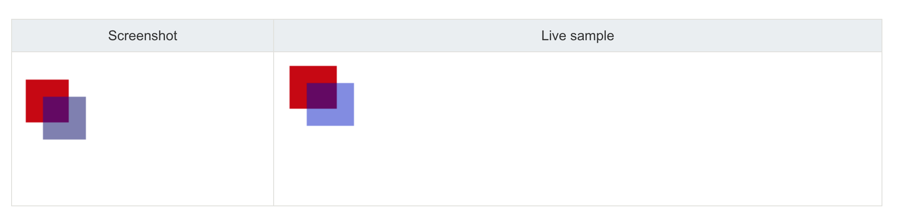

# 移植笔记

## front-end部分

### Element-UI组件

+ [button 按钮](https://element.eleme.cn/#/zh-CN/component/button)
  + 使用`type`, `plain`, `round`和`circle`属性来定义Button的样式
    + `type`：指定当前按钮的类型，有`primary`, `success`, `info`, `warning`和`danger`样式，样式的不同有产生颜色的不同；
    + `plain`：朴素选项。如果添加这一选项，按钮背景会变得透明；
    + `round`：圆角选项。如果添加这一选项，按钮变换为圆角按钮；
    + `circle`：圆形按钮选项。如果添加这一选项，按钮将变成圆形按钮。此时可以通过`icon`属性设置图标；
    ```html
    <el-row>
        <el-button>默认按钮</el-button>
        <el-button type="primary">主要按钮</el-button>
    </el-row>
    <el-row>
        <el-button plain>朴素按钮</el-button>
        <el-button type="primary" plain>主要按钮</el-button>
    </el-row>
    <el-row>
        <el-button round>圆角按钮</el-button>
        <el-button type="primary" round>主要按钮</el-button>
    </el-row>
    <el-row>
        <el-button icon="el-icon-search" circle></el-button>
        <el-button type="primary" icon="el-icon-edit" circle></el-button>
    </el-row>
    ```
    
    
    <center>
      图一 Element-UI按钮组件示意图
    </center>
    
    
    
  + 禁用状态：可以使按钮进入不可用状态。可以使用`disabled`属性来定义按钮是否可用，它接受一个`Boolea`类型的值。
    
    ```html
        <el-button disabled>默认按钮</el-button>
    ```
    
  + 文字按钮：没有边框和背景色的按钮。利用`type`属性定义
    ```html
        <el-button type="text">文字按钮</el-button>
    ```
    
  + 图标按钮：设置`icon`属性即可，icon的列表可以参考Element的[icon组件](https://element.eleme.cn/#/zh-CN/component/icon)，也可以设置在文字右边的icon，只要使用`<i>`标签即可，可以使用自定义图标
    ```html
        <el-button icon="el-icon-edit"></el-button>
        <el-button icon="el-icon-search">搜索</el-button>
        <el-button type="primary">上传<i class="el-icon-upload el-icon--right"></i></el-button>
    ```
    
  + 组按钮：使用`<el-button-group>`标签来嵌套你的按钮；
    ```html
    <el-button-group>
        <el-button icon="el-icon-eidt"></el-button>
        <el-button icon="el-icon-share"></el-button>
        <el-button icon="el-icon-delete"></el-button>
    </el-button-group>
    ```
    
  + 加载中： 要设置为 loading 状态，只要设置`loading`属性为`true`即可。
    ```html
    <el-button type="primary" :loading="true">加载中</el-button>
    ```
    

## 基础部分

### HTML

+ HTML `<script>`标签的作用：在HTML 页面中插入一段 JavaScript。
+ [document.querySelector()](https://developer.mozilla.org/zh-CN/docs/Web/API/Document/querySelector)
	+ 文档模型对象[Document](https://developer.mozilla.org/zh-CN/docs/Web/API/Document)引用的`querySelector()`方法

#### \<canvas\>标签

##### canvas的基本用法

**渲染上下文**

​	`<canvas>`元素创造了一个固定大小的画布，它公开了一个或多个渲染上下文，其可以用来绘制和处理要展示的内容。我们会将注意力放在2D渲染上下文中。其他种类的上下文也许提供了不同种类的渲染方式。

​	canvas初始是空白的。为了展示，首先脚本需要找到渲染上下文，然后在它的上面绘制。`<canvas>`元素有一个叫做`getContext()`的方法，这个方法是用来渲染上下文和它的绘画功能。`getContext()`只有一个参数，上下文的格式。对于2D图像而言，如本教程，你可以使用 [`CanvasRenderingContext2D`](https://developer.mozilla.org/zh-CN/docs/Web/API/CanvasRenderingContext2D)。	

```javascript
var canvas = document.getElementById('tutorial');
var ctx = canvas.getContext('2d');
```

**一个简单例子**

​	一开始，让我们来看个简单的例子，我们绘制了两个有趣的长方形，其中的一个有着alpha透明度。我们将在接下来的例子里深入探索一下这是如何工作的。

```html
<html>
  <head>
    <script type="application/javascript">
    	function draw() {
				var canvas = document.getElementById("canvas");
        if (canvas.getContext) {
          var ctx = canvas.getContext("2d");
          
          ctx.fillStyle = "rgb(200, 0, 0)";
          ctx.fillRect(10, 10, 55, 50);
          
          ctx.fillStyle = "rgba(0, 0, 200, 0.5)";
          ctx.fillRect(30, 30, 55, 50);
        }
      }
    </script>
  </head>
  <body onload="draw();">
   <canvas id="canvas" width="150" height="150"></canvas>
 	</body>
</html>
```

​	例子看起来是这样：



##### 使用图像 Using images

**由零开始创建图像**

我们可以用脚本创建一个新的`HTMLImageElement`对象。要实现这个办法，我们可以使用很方便的`Image()`构造函数。

```javascript
var img = new Image();		//创建一个元素
img.src = 'myImage.png';	//设置图片源地址
```


### Javascript

#### 问题集锦

问题描述：[JS中let和var的区别](https://es6.ruanyifeng.com/#docs/let)

-----


### CSS

+ id选择器和class选择器

	+ id选择器：id选择器可以为标有特定id的HTML元素指定特定的样式。HTML元素以id属性来设置id选择器，CSS中id选择器以"#"来定义。以下的样式规则应用于元素属性`id="para1"`：

		```css
		#para1
		{
			text-align:center;
		  color:red;
		}
		```

	+ class选择器：class选择器用于描述一组元素的样式，class选择器有别于id选择器，在CSS中，类选择器以一个点"."号表示。在以下的例子中，所有拥有center类的HTML元素均为居中：

		```css
		.center {text-align:center;}
		```

		也可以指定特定的HTML元素使用class。在以下实例中，所有`p`标签使用`class="center"`让该元素的文本居中：

		```css
		p.center {text-align:center;}
		```

### npm

+ 在vue-cli中添加第三方库

	+ 这里举安装`bootstrap`为例。首先，通过`npm view bootstrap version`查看安装的版本。我得到的输出为4.5.2。

	+ 之后，修改项目根目录下的`package.json`，添加与`bootstrap`对应的配置

		```
		"dependencies": {
		    "axios": "^0.19.2",
		    "element-ui": "^2.13.2",
		    "vue": "^2.5.2",
		    "vue-router": "^3.0.1",
		    "vuex": "^3.5.1",
		    "bootstrap": "^4.5.2"
		  },
		```

	+ 之后利用`npm install`安装第三方库。但是，可能会出现错误：

		```
		npm WARN bootstrap@4.5.2 requires a peer of ...
		```

	+ 这时候就需要根据其缺少的组件对所需要的第三方库进行安装。在安装`bootstrap`时可能需要安装`jQuery`和`popper.js`第三方库

		+ 需要注意：`popper.js`和`popper`不是同一个库


### vue

#### 问题集锦

问题描述：[Vue中mounted钩子函数中不能获取到data中的数据](https://blog.csdn.net/qq_42109746/article/details/101982318)

问题原因：这是因为在mounted()钩子函数中，this指向的是window作用域，所以会出现获取到的data中的数据出现没有定义的情况。

解决办法：只需要解决 this 的指向问题，便可以重新获取到data中的数据，如将 this 指定另一个变量，这样在mounted() 钩子函数的子函数中，便可以重新获取到data中的数据。

------

问题描述：[Vue中在mounted方法中会用data变量](https://blog.csdn.net/VcStrong/article/details/89917172)

解决方法：使用this对data中变量进行调用：

```js
data: {
  certificates: null
},
mounted: function() {
	var __this = this;
  __this.certificates = getDictForkey("学历");
}
```

------

问题描述：[使用vue-router会在地址栏自动添加/#/号](https://segmentfault.com/q/1010000009134004/a-1020000009137571)

解决办法：

### Webpack

#### [配置(Configuration)](https://webpack.docschina.org/concepts/configuration/)

​	你可能已经注意到，很少有 webpack 配置看起来完全相同。这是因为 webpack 的配置文件是 JavaScript 文件，文件内导出了一个 webpack配置的对象。webpack会根据定义的属性进行处理。

​	由于webpack遵循CommonJS模块规范，因此你可以在配置中使用：

+ 通过`require(...)`引入其他文件
+ 通过`require(...)`使用npm下载的工具函数
+ 使用JavaScript控制流表达式，例如`?:`操作符
+ 对 value 使用常量或变量赋值
+ 编写并执行函数，生成部分配置

##### 基本配置

**webpack.config.js**

```javascript
var path = require('path')

module.exports = {
  mode: 'development',
  entry: './foo.js',
  output: {
    path: path.resolve(__dirname, 'dist'),
    filename: 'foo.bundle,js'
  }
}
```


## 测试日志

### 添加js组件

+ 尝试在index.html中直接移植原网页中`<script>`标签的语句，但是似乎没有办法通过这种方式导入blockly库文件

+ 通过修改前端文件夹根目录下的`package.json`安装第三方库`bootstrap`和`blockly`：

	

	